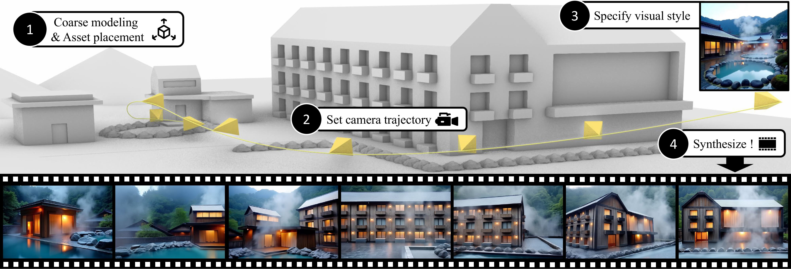

<h1>
    📽️ VideoFrom3D 📽️  
    3D Scene Video Generation via Complementary Image and Video Diffusion Models
</h1>

    <a href='https://kimgeonung.github.io/' target='_blank'>Geonung Kim</a>&emsp;
    <a target='_blank'>Janghyeok Han</a>&emsp;
    <a href='https://www.scho.pe.kr/' target='_blank'>Sunghyun Cho</a>&emsp;

    POSTECH

    <strong>SIGGRAPH-ASIA 2025 Conference </strong>

    <h4 align="center">
        <!-- <a href="https://kimgeonung.github.io/id-compression/" target='_blank'> -->
        
        </a>
        <!-- <a href="https://arxiv.org/abs/2401.17547" target='_blank'> -->
        
        </a>
    </h4>

 
---

## 🔥 Update

- [2025.09.08] The repository is created.

## 🔧 Todo

- [ ] Release inference code
- [ ] Release model checkpoint
- [ ] Release training code
🎞️

<!-- ## ⌨️  Program -->
<!--  -->
<!-- ### Download checkpoint -->
<!--  -->
<!-- ### Environment -->
<!--  -->
<!-- ### Quick start -->
<!--  -->
<!-- ### Preprocessing -->

<!--  -->
<!-- ### SAG inference -->
<!--  -->
<!-- ### GGI inference -->

## ☕️ Acknowledgment

- We borrowed the readme format from [Upscale-A-Video](https://github.com/sczhou/Upscale-A-Video) 
- We finetune a pretrained video diffusion model, [CogVideoX](https://github.com/zai-org/CogVideo) 
- We generate anchor views using [Flux ControlNet](https://huggingface.co/XLabs-AI/flux-controlnet-collections) 
